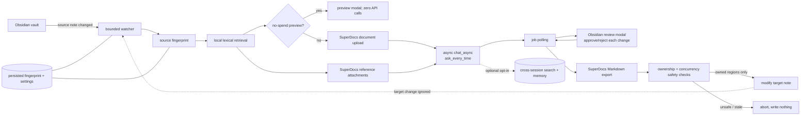

# Architecture

## Invariants

1. The watcher is triggered by source changes only; target output never feeds its own trigger.
2. A source fingerprint is processed at most once on the automatic path.
3. SuperDocs receives an explicit ownership prompt and untrusted-source warning.
4. Human approval precedes export and local write.
5. `replaceOwnedRegions` requires all original markers in the exported response and preserves all bytes outside their content ranges.
6. The target is re-read before write; concurrent human edits abort the commit.
