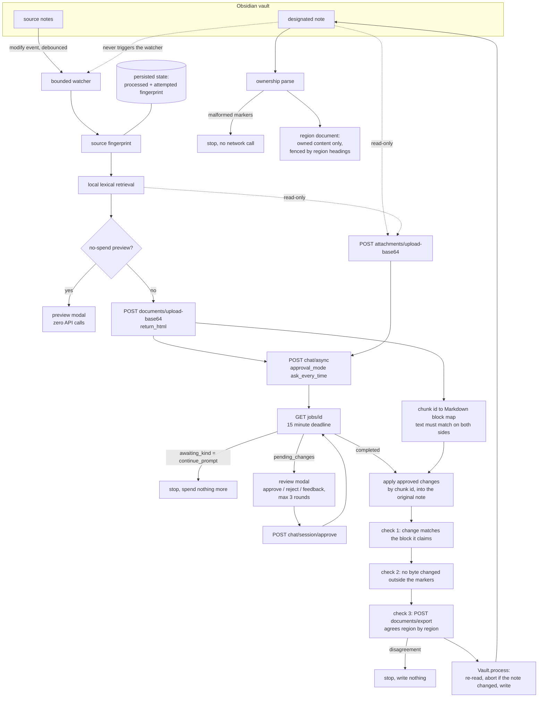

# Architecture

## Invariants

1. The editable document contains owned-region content and nothing else. Human prose reaches SuperDocs only as a read-only attachment, so an edit to it cannot be proposed.
2. The watcher is driven by source changes; the designated note is excluded, so output never becomes input.
3. A source fingerprint is attempted at most once on the automatic path. The attempt is recorded before the first paid call, so a failure cannot bill in a loop.
4. Human approval precedes every write, change by change.
5. An approved change is placed by chunk id, and only after the text SuperDocs claims it is replacing matches the Markdown block that chunk came from.
6. `assertNoUnownedChange` re-derives the candidate from the original and refuses anything that differs outside the markers.
7. The Markdown export is compared against the local result region by region; disagreement writes nothing.
8. The note is re-read inside `Vault.process`; a human edit during the review aborts the write.
9. Malformed, duplicated, nested, unclosed or overlapping markers stop the run before any network call.
10. Preview performs local work only: no request, no operation.
